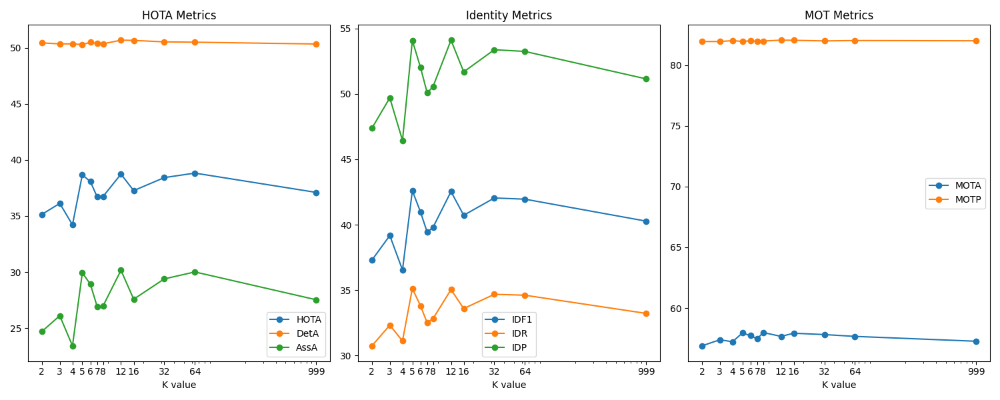

[toc]

# Readme

> make a small record about my train of thought when trying to apply GNN to MOT

## 1. Brief Introduction about My Model

> Reference paper : [Recurrent graph optimal transport for learning 3D flow motion in particle tracking(Nature 2023)](https://www.nature.com/articles/s42256-023-00648-y)


My model is an **online and graph-based** tracker. The main difference from other online and graph-based trackers is that the way of constructing graph and graph convolutions , which is innovative in the realm of MOT but also brings some limitations that still haunt on me:thinking:. So the following discussions mainly focus on the above two points.

Here comes the first discussion which is the **construction of a graph**. Specifically, the appearance features extracted by CNN Model of each object is initialized as node embedding , and the 2 dimension pixel position of each object is used to compute graph structure and edge embedding.

1. **Graph structure** : I utilize **KNN algorithm** to construct a **self-looped and directed** graph;

2. **Edge embedding** : In order to model the relative relationship between connecting nodes , I concatenate the 6 scalar below and feed them to a MLP module to encode a 16 dimension tensor as edge embedding.

$$
Edge~emb := f([\frac{2(x_j - x_i)}{h_i + h_j},\frac{2(y_j-y_i)}{h_i+h_j},log(\frac{w_j}{w_i}),log(\frac{h_j}{h_i}),diouDist(i,j))])
$$


And in order to **track each object** , there are two graphs which are built on above rules — one is based on the past trajectories and the other is based on current detections. So, the MOT problem can be converted to:star2: **graph matching problem**:star2:, which is NP complete.

Additionally, let\`s talk about my **graph convolutional operations**, which is mainly from the [paper](https://www.nature.com/articles/s42256-023-00648-y), i.e. Edgeconv. The functions goes like this, which is **minor different from the original version** : ( $[\cdot]$ means concatenation )


$$
g^{l+1}_i:= \max _{j \in \mathbb{N}_i}{f([g_i^{l}~\cdot~(g_j^{l} - g_i^{l})~\cdot~ Edge~emb])}
$$

And in order to **capture high-order discriminative features**, I rebuild the graph, which I call the `dynamic graph`, while the old one is referred to as the `static graph` to keep things clear. And I also perform the edgeconv operations on dynamic graph:


$$
g^{l+1}_i:= \max _{j \in \mathbb{N}_i}{f([g_i^{l}~\cdot~(g_j^{l} - g_i^{l})])}
$$

----

The last but not least, it\`s necessary to take a glimpse of my **trajectory management strategy**. My trajectory management strategy mainly refers to **ByteTrack**. And here is my program flow chart:


There are four states in the trajectory management strategy — **Born,Active,Sleep,Dead**. It\`s possible that `Born Trajectory` can be false positive, i.e. noise, so there are two phases in trajectory management — `Match Strategy` for denoising and `Graph Matching` for matching. And the rest of the strategy is unnecessary to discuss, which is obvious in the flow chart.

## 2. Experimental Settings

- Here the baseline is **GCNNMatch**，which also attempts to use GNN to solve the challenges in MOT.
- And the benchmark is **MOT17**, whose **half data for training** and **the other for validation**. 
- Apart from the half data of MOT17 for validation, there are **some private data also using for validation** (Indoor & Day  -- self dataset ) in order to test the robustness of models.

So there is some quantitative results when **GCNNMatch training on MOT17-half**  tests on **my validation set**.

|   Validation set   | HOTA  | DetA  | AssA  | IDF1  |  IDR  |  IDP  | MOTA  | MOTP  |
| :----------------: | :---: | :---: | :---: | :---: | :---: | :---: | :---: | :---: |
|  MOT17-half(SDP)   | 48.68 | 48.43 | 49.00 | 57.39 | 46.20 | 75.72 | 56.44 | 83.56 |
| Indoor Day(YOLOv8) | 36.11 | 66.81 | 19.67 | 33.18 | 32.53 | 33.86 | 87.51 | 76.07 |

And the GCNNMatch is :warning:**extremely time-consuming**, which takes about 2 seconds to process each frame in a 30fps, 1080p video.

----

- For the purpose of  **fast training  and relatively fair comparison** , my own model also **trains on half data  of MOT17 and tests on MOT17-half**. Besides, **max epoch is set to 40, batch size is set to 16, warmup iterations are set to 500**.
- And **random seed is set to 3407 ** || **k is set to 2 **

Here is the original quantitative results of my model without **any modification on model structure or the use of any data augmentation techniques**. 

| Validation set  | HOTA  | DetA  | AssA  | IDF1  |  IDR  |  IDP  | MOTA  | MOTP  |
| :-------------: | :---: | :---: | :---: | :---: | :---: | :---: | :---: | :---: |
| MOT17-half(SDP) | 23.96 | 45.44 | 12.66 | 23.14 | 18.08 | 32.14 | 41.54 | 83.79 |

Obviously, my model still have a long way to go. However, what makes me proud is that my model has **a relatively fast inference speed**, which can reach up to 15 fps or so to process a 30fps, 1080p video.

----

And it is also essential to record the time consumption of training and inference in different computer power platform.

- **Training Time Analysis:**

  Here are two computing systems to train all following models of different experimental settings:

  |  Platforms  |           CPU           |      GPU      |
  | :---------: | :---------------------: | :-----------: |
  | 4090(Linux) | Platinum 8352V (2.5GHz) | RTX4090 (8.9) |
  | 3090(Linux) |    i9-13900K (3GHz)     | RTX3090 (8.6) |

  Additionally, there is also a minor difference in hardware architecture of the two platforms: **the 4090 system uses a southbridge chip** to establish a communication link between the CPU and GPU, while the **3090 system lacks a southbridge chip**, allowing the CPU and GPU to communicate directly. As a result, **the speed on the 3090 system is faster than on the 4090 system when training.** And here is more detailed comparison:

  |  Platform   | Data <br/>Loading Time | Data <br/>Migration Time | Model Time<br>(Forward + Backward) | Total Time<br>(120 Epoch) |
  | :---------: | :--------------------: | :----------------------: | :--------------------------------: | :-----------------------: |
  | 4090(Linux) |        0.000 s         |          0.1 s           |               0.45 s               |        3 h 38 min         |
  | 3090(Linux) |        0.000 s         |          0.05 s          |               0.34 s               |        2 h 15 min         |

  P.S. TOTAL EPOCH is set to 120 , TOTAL NUMBER of TRAIN DATASET is 2650 and BATCH SIZE is 16. Plus, whole model is trained in a single GPU, not in distributed training. NUM WORKER is set to 6 in 4090 and 2 in 3090.

- **Inference Time Analysis:**

  Here is also three platforms to do evaluation (Model Inference) after training.

  |   Platforms   |           CPU           |      GPU      |
  | :-----------: | :---------------------: | :-----------: |
  | 4090 (Linux)  | Platinum 8352V (2.5GHz) | RTX4090 (8.9) |
  | 3090 (Linux)  |    i9-13900K (3GHz)     | RTX3090 (8.6) |
  | 3060 (Window) |    i5-12490F (3GHz)     | RTX3060 (8.6) |
  
  And here is the time consumption of different **resolution** video in both two platforms:
  
  |   Platforms   | 480p Video | 1080p Video | 4K video |
  | :-----------: | :--------: | :---------: | :------: |
  | 4090 (Linux)  |   25 FPS   |   13 FPS    |  9 FPS   |
  | 3090 (Linux)  |   68 FPS   |   30 FPS    |  13 FPS  |
  | 3060 (Window) |   30 FPS   |   15 FPS    |  8 FPS   |
  
  P.S. **the bigger K in KNN sets, the slower model infers.**

## 3. TO DO List

- [x] initialize the parameter of  networks plz !

- [x] attempt to use more data augmentation techniques to improve my model

  - [x] simulate low framerate
  - [x] simulate missed detections 
  - [x] simulate discontinuous trajectories

- [x] change directed graph to undirected one

- [x] change graph conv to `GraphConv-type`

- [x] add a mask based pixel distance 

  - [x] I can also statistically calculate the moving distances of different time span , framerates and resolutions

- [ ] change the weight of edge 

  I can encode the some info of graph structure into the embeddings(maybe cant be so sufficient)

- [ ] Design more suitable track management ,like the lifespan of active tracks

- [x] Simplify the logic of KNN — make KNN more adaptive . It seems that variable `bt_self_loop`  is relatively useless, because self-loop only matters when there is only one object, which will lead to fatal error in my project. And this maybe save more time expense. 

- [ ] do some statistical experiment about the density of the crowds in benchmarks, which is maybe helpful for the choice of best K

## 4. Experimental Records [Technique & Hyperparameters]

The quantitative results of the vanilla model  (the same results in [[Sec 1. Brief Introduction about My Model]](#1. Brief  Introduction about My Model), just repeat one more time and add some curves which can reflect something):

| Validation set  | HOTA  | DetA  | AssA  | IDF1  |  IDR  |  IDP  | MOTA  | MOTP  |
| :-------------: | :---: | :---: | :---: | :---: | :---: | :---: | :---: | :---: |
| MOT17-half(SDP) | 23.96 | 45.44 | 12.66 | 23.14 | 18.08 | 32.14 | 41.54 | 83.79 |


Apart from the quantitative results of the vanilla one , let\`s focus on these two curves. The training data is 2650, which is relatively small and easily make models overfit. So I have to design more precise training strategy to avoid overfitting, where I adjust the warmup strategy and multiStep lr scheduler.

Noted that the f1 curve in evaluation phase surges to 0.9 or so and then slowly grows up, this f1 score is slightly different from one in MOT metric. Both of them is based on ID of tracked object, but the f1 score here is calculated in each timestamp — in other words, **the default prerequisite here is that the tracking result of each timestamp is independent**, which is quite different from one in MOT metric. [ ]

As we all known, the MOT problem can be viewed as a problem of **maximizing a posteriori probability** —— the tracking result of each timestamp is quite dependent on the results of previous moment. It\`s reasonable to infer that the worse tracking results from previous moment, the worse tracking results from current moment. Actually, the performance of my model is indeed like this.

### 4.1 After data Augmentation [🎉]

> In order to avoid overfitting, it\`s overwhelmingly necessary to find out the various and valid data augmentation techniques.


There are three data augmentation techniques — **Low framerate, missed detections and discontinuous trajectories. **All of them is vividly showed in the above picture. So let\`s see the quantitative results of vanilla model after training. Oops, I changes some experimental settings. In this experiment, the total epoch is set to 120  (it maybe takes 2 hours or so in GTX3090 ), warmup iteration is set to 800 and multistep is set to 50 and 80.(Waiting to see :eyes:)

|       Conditions        |   HOTA    |   DetA    | AssA  |   IDF1    |    IDR    |  IDP  |   MOTA    |   MOTP    |
| :---------------------: | :-------: | :-------: | :---: | :-------: | :-------: | :---: | :-------: | :-------: |
| Vanilla one<sup>*</sup> |   23.96   |   45.44   | 12.66 |   23.14   |   18.08   | 32.14 |   41.54   |   83.79   |
|    Data Augmentation    | **25.29** | **51.08** | 12.57 | **25.02** | **20.49** | 32.13 | **50.01** | **83.86** |


:loudspeaker: Obviously,**my model is not overfitting in the whole training phase due to three data augmentation techniques. And I wanna  **<strong style="color: red;">use this as the main comparison which marks as Vanilla one<sup>*</sup>.</strong> 

### 4.2 After Undirected graph [:sob:]

Here is the simple illustration about the undirected graph:


Unfortunately, it doesn`t seem to have a significant improvement, but rather a slight decrease. :sob:

|       Conditions        |   HOTA    |   DetA    |   AssA    |   IDF1    |    IDR    |    IDP    |   MOTA    |   MOTP    |
| :---------------------: | :-------: | :-------: | :-------: | :-------: | :-------: | :-------: | :-------: | :-------: |
| Vanilla one<sup>*</sup> | **25.29** | **51.08** | **12.57** | **25.02** | **20.49** | **32.13** | **50.01** | **83.86** |
|    Undirected Graph     |   23.88   |   51.02   |   11.22   |   23.13   |   18.93   |   29.72   |    50     |   83.80   |


### 4.3 After Distance mask [:tada:]


What\` s distance mask here ? Actually, it is a kind of precondition which is that the movement distance of objects in adjacent frames is likely to be small, but **sometimes can be large when in low framerate video or objects moving fast**. So it\`s necessary to statistically calculate **the max movement distance** of different situations, like **different framerate, fast-moving objects or video from a moving perspective.**  And here is the statistical results in **MOT17(Train set), MOT20(Train set), DanceTrack(Train && val set)**.


Noted that it seems that the **max movement distance of adjacent frames (window - 2) is more reliable**. Let\`s dive into the situations of **windowSize[2]**.


It seems that **the speed of object moving poses the bigger influence on the statistical experiment among all factors.**:confused: Oops, maybe **the distance between camera and objects also matters!**

The following two tables present **different experimental settings**, both of which **utilize the Distance Mask Technique**, resulting in **unusually yet reasonable outcomes**. 

1. **Trained with mask** (first table): I apply distance mask only in training phases but also in evaluation phases
2. **Trained without mask** (second table || **Only Evaluated with mask**): I apply distance mask to vanilla model<sup>*</sup> only in evaluation phases

| Mask Range<br>[trained *w/* mask] |   HOTA    | DetA  |   AssA    |   IDF1    |    IDR    |    IDP    | MOTA  | MOTP  |
| :-------------------------------: | :-------: | :---: | :-------: | :-------: | :-------: | :-------: | :---: | :---: |
|   None(Vanilla one<sup>*</sup>)   |   25.29   | 51.08 |   12.57   |   25.02   |   20.49   |   32.13   | 50.01 | 83.86 |
|                35                 |   39.53   | 52.33 |   29.94   |   43.65   |   36.00   |   55.44   | 58.03 | 83.88 |
|                50                 |   40.62   | 52.16 |   31.73   | **44.76** | **36.91** | **56.85** | 57.58 | 83.81 |
|                60                 | **40.71** | 51.99 | **31.97** |   44.15   |   36.41   |   56.08   | 57.33 | 83.86 |
|                100                |   38.51   | 51.65 |   28.80   |   41.37   |   34.10   |   52.59   | 56.25 | 83.83 |
|                150                |   33.57   | 51.57 |   21.92   |   34.55   |   28.42   |   44.06   | 52.39 | 83.84 |
|                200                |   30.70   | 51.61 |   18.33   |   31.62   |   26.00   |   40.36   | 52.50 | 83.87 |
|                250                |   29.50   | 51.52 |   16.94   |   29.38   |   24.14   |   37.52   | 51.14 | 83.90 |
|                300                |   29.70   | 51.34 |   17.24   |   30.07   |   24.67   |   38.48   | 52.20 | 83.89 |
|                350                |   29.34   | 51.30 |   16.84   |   29.52   |   24.23   |   37.76   | 51.54 | 83.83 |
|                400                |   27.60   | 51.42 |   14.86   |   26.91   |   22.08   |   34.44   | 51.39 | 83.82 |
|              450(re)              |   26.05   | 51.46 |   13.25   |   25.68   |   21.08   |   32.83   | 51.63 | 83.83 |
|              500(re)              |   28.01   | 51.47 |   15.32   |   27.46   |   22.55   |   35.09   | 51.80 | 83.83 |

| Mask Range<br>[trained *w/o* mask] |   HOTA    | DetA  |   AssA    |   IDF1    |    IDR    |    IDP    | MOTA  | MOTP  |
| :--------------------------------: | :-------: | :---: | :-------: | :-------: | :-------: | :-------: | :---: | :---: |
|   None(Vanilla one<sup>*</sup>)    |   25.29   | 51.08 |   12.57   |   25.02   |   20.49   |   32.13   | 50.01 | 83.86 |
|                 35                 |   41.80   | 52.40 |   33.40   |   47.37   |   39.08   |   60.13   | 59.16 | 83.79 |
|                 50                 |   42.36   | 52.14 |   34.51   |   48.28   |   39.83   |   61.28   | 59.16 | 83.82 |
|                 60                 | **43.17** | 52.02 | **35.92** | **48.81** | **40.26** | **61.97** | 58.80 | 83.82 |
|                100                 |   39.47   | 51.84 |   30.12   |   43.00   |   35.44   |   54.67   | 57.44 | 83.85 |
|                150                 |   35.24   | 51.98 |   23.98   |   37.16   |   30.60   |   47.30   | 55.15 | 83.82 |
|                200                 |   33.04   | 51.95 |   21.06   |   34.34   |   28.27   |   43.73   | 54.25 | 83.82 |
|                250                 |   30.69   | 51.76 |   18.25   |   31.50   |   25.91   |   40.15   | 53.45 | 83.84 |
|                300                 |   29.72   | 51.70 |   17.14   |   30.57   |   25.14   |   39.00   | 52.99 | 83.83 |
|                350                 |   29.63   | 51.62 |   17.06   |   30.58   |   25.13   |   39.04   | 52.89 | 83.82 |
|                400                 |   28.36   | 51.68 |   15.61   |   28.43   |   23.36   |   36.29   | 52.46 | 83.80 |
|                450                 |   28.32   | 51.59 |   15.59   |   28.47   |   23.39   |   36.37   | 51.89 | 83.83 |
|                500                 |   27.73   | 51.52 |   14.98   |   27.52   |   22.59   |   35.19   | 51.56 | 83.81 |

 In order to more intuition comparison, I plot a line chart based on the above two tables : [without **row None (Vanilla one<sup>*</sup>)** ]


Although deep learning is famous for its uninterpretability, we can also try to understand the model\`s logic using our engine experience. So here is the my humble understanding about this unusual performance of different experimental settings. For example, the `Distance Mask Technique` can be viewed as `a magic tool (like GPT-4)`, which is quite helpful for programmers to coding. And here are two freshmen in python. Both of them learn python in a completely different way — the first person`(Trained with mask)` relies heavily on this tool for learning and blindly trusts whatever this tool output. In contrast, the second person`(Trained without mask)` never use this tool for learning but applies it during practical tasks. As time goes by, the first person gradually developed a strong dependence on this tool and the other become a experienced and brilliant programmer :)

All in all, the previous performance comparison shows that **the position of applying distance mask technique matters.** So in the following exploration, I will only use distance mask technique only in evaluation phase.

### 4.4 After Different K [:tada:]

According to the descriptions about construction graph in [[Sec 1. Brief Introduction about My Model]](#1. Brief Introduction about My Model), there is a hyperparameter `k` in KNN algorithm. And k is set to 2 in my vanilla model, so let`s search for best k.

Inspired by the discovery in the previous section, I also design two experimental settings of different K:

1. retrain the models of different k (first table);
2. use different k but same model (Vanilla one<sup>*</sup>) in evaluation phase.

|             Different K              |   HOTA    | DetA  |   AssA    |   IDF1    |    IDR    |    IDP    | MOTA  | MOTP  |
| :----------------------------------: | :-------: | :---: | :-------: | :-------: | :-------: | :-------: | :---: | :---: |
|     k=2(Vanilla one<sup>*</sup>)     |   25.29   | 51.08 |   12.57   |   25.02   |   20.49   |   32.13   | 50.01 | 83.86 |
|                 k=3                  |   27.29   | 51.14 |   14.61   |   27.84   |   22.83   |   35.67   | 52.56 | 83.82 |
|                 k=4                  |   28.87   | 51.33 |   16.30   |   30.06   |   24.67   |   38.46   | 53.53 | 83.85 |
|                 k=5                  |   29.87   | 51.27 |   17.45   |   30.59   |   25.08   |   39.20   | 53.46 | 83.82 |
|                 k=6                  |   29.25   | 51.56 |   16.64   |   30.33   |   24.91   |   38.76   | 53.76 | 83.81 |
|                 k=7                  |   28.79   | 51.10 |   16.27   |   29.28   |   24.00   |   37.54   | 53.00 | 83.81 |
|                 k=8                  |   29.86   | 51.46 |   17.36   |   30.80   |   25.30   |   39.38   | 54.10 | 83.81 |
|                 k=12                 | **30.33** | 51.09 | **18.06** | **32.34** | **26.53** | **41.41** | 53.21 | 83.82 |
|                 k=16                 |   29.99   | 51.20 |   17.50   |   31.74   |   26.04   |   40.64   | 52.63 | 83.79 |
| k=999(INF)<br>(Full Connected Graph) |   25.40   | 46.24 |   13.99   |   25.89   |   20.37   |   35.40   | 42.60 | 83.76 |
|              k=5(6-dim)              |   27.75   | 50.37 |   15.32   |   27.78   |   22.60   |   36.02   | 51.06 | 83.84 |
|              k=6(6-dim)              | **31.47** | 50.82 | **19.54** | **32.69** | **26.71** | **42.12** | 54.23 | 83.80 |

| Different K <br>[only in Evaluation phases] | HOTA  | DetA  | AssA  | IDF1  |  IDR  |  IDP  | MOTA  | MOTP  |
| :-----------------------------------------: | :---: | :---: | :---: | :---: | :---: | :---: | :---: | :---: |
|        k=2(Vanilla one<sup>*</sup>)         | 25.29 | 51.08 | 12.57 | 25.02 | 20.49 | 32.13 | 50.01 | 83.86 |
|                     k=3                     | 25.60 | 51.09 | 12.87 | 24.24 | 19.85 | 31.12 | 50.24 | 83.86 |
|                     k=4                     | 26.11 | 50.99 | 13.41 | 24.87 | 20.36 | 31.93 | 50.28 | 83.86 |
|                     k=5                     | 26.80 | 51.13 | 14.08 | 25.06 | 20.52 | 32.20 | 50.08 | 83.86 |
|                     k=6                     | 27.00 | 51.03 | 14.33 | 26.00 | 21.28 | 33.43 | 49.81 | 83.86 |
|                     k=7                     | 27.00 | 51.12 | 14.30 | 26.36 | 21.57 | 33.87 | 50.03 | 83.87 |
|                     k=8                     | 26.99 | 51.02 | 14.30 | 26.04 | 21.31 | 33.46 | 50.01 | 83.84 |

Obviously, it\`s not effective way to apply different k in the vanilla model<sup>*</sup>, whose k is 2 in training. Actually, it should have been like this. **In my opinion,the models of different K, when training, can learn different inductive bias , which make model prioritise solutions with certain properties, or have a different capability of feature extraction**

Besides, here is a picture to visually illustrates the process of graph construction with the increase of K. ( Due to the shape of each figure, the relative positions of every nodes are distorted to some extent. And **the following graph construction is based on true coordinates in original image plane**) P.S.  Confront with some common but special situations, like **only  objects (maybe less than K value)**, my model will **adaptively adjust the K value** (make K equal to `number of object - 1` ). If K is set to a infinite number, like 999, the KNN graph will be converted into full connected graph.


And here is a line chart which shows the trend of performance with increasing K : (data from first table)



### 4.5 After Edge Embeddings

The reason why I wanna change the weight of edge is **the week connection between similar objects or closely positioned objects.** In other words, for similar objects in close positions, **the current model has week differentiation capability (i.e. insufficient feature discriminability).** More details in the following picture.


How to alleviate or even solve this problem? Some trial methods are waiting for me to practice.

#### 4.6.1 several Variants of Edge Embedding

Curious about the influences of edge embedding , I design several variants of Edge embedding  and do some experiments. And here are some mathematical formulation of my ideas. [The edge embedding of `Vanilla model`  mainly refers [SUSHI(CVPR 2023)](https://openaccess.thecvf.com/content/CVPR2023/papers/Cetintas_Unifying_Short_and_Long-Term_Tracking_With_Graph_Hierarchies_CVPR_2023_paper.pdf) , which is a offline and graph-based tracker. And it\` another motivation to encourage me to solve the puzzle ]

1. **4-dim** Edge embedding (normalized by the **length and width of the original image**):
   $$
   Edge~emb := f([\frac{x_j - x_i}{w},\frac{y_j-y_i}{h},log(\frac{w_j}{w_i}),log(\frac{h_j}{h_i})])
   $$

2. **4-dim** Edge embedding (normalized by the **length and width of the bounding box of source nodes** ,i.e. neighbor nodes):
   $$
   Edge~emb := f([\frac{x_j - x_i}{w_j},\frac{y_j-y_i}{h_j},log(\frac{w_j}{w_i}),log(\frac{h_j}{h_i})])
   $$

3. **4-dim** Edge embedding (normalized by the **length and width of the bounding box of target nodes**):
   $$
   Edge~emb := f([\frac{x_j - x_i}{w_i},\frac{y_j-y_i}{h_i},log(\frac{w_j}{w_i}),log(\frac{h_j}{h_i})])
   $$

4. **4-dim** Edge embedding (normalized by the **mean width and height of nodes**):
   $$
   Edge~emb := f([\frac{2(x_j - x_i)}{w_i+w_j},\frac{2(y_j-y_i)}{h_i+h_j},log(\frac{w_j}{w_i}),log(\frac{h_j}{h_i})])
   $$

5. **4-dim** Edge embedding (normalized by the **mean height of nodes**):
   $$
   Edge~emb := f([\frac{2(x_j - x_i)}{h_i+h_j},\frac{2(y_j-y_i)}{h_i+h_j},log(\frac{w_j}{w_i}),log(\frac{h_j}{h_i})])
   $$

6. **4-dim** Edge embedding (normalized by the **mean width of nodes**):
   $$
   Edge~emb := f([\frac{2(x_j - x_i)}{w_i+w_j},\frac{2(y_j-y_i)}{w_i+w_j},log(\frac{w_j}{w_i}),log(\frac{h_j}{h_i})])
   $$

7. **5-dim** Edge embedding (add **IOU distance** as another dimension to supply more information):
   $$
   Edge~emb := f([\frac{2(x_j - x_i)}{h_i + h_j},\frac{2(y_j-y_i)}{h_i+h_j},log(\frac{w_j}{w_i}),log(\frac{h_j}{h_i}),iouDist(i,j)])
   $$

8. **5-dim** Edge embedding (add **DIOU distance** as another dimension to supply more information): [Actually, the same as `Vanilla model`]
   $$
   Edge~emb := f([\frac{2(x_j - x_i)}{h_i + h_j},\frac{2(y_j-y_i)}{h_i+h_j},log(\frac{w_j}{w_i}),log(\frac{h_j}{h_i}),diouDist(i,j)])
   $$

9. **6-dim** Edge embedding (add **Cosine distance** as another dimension to supply more information):
   $$
   Edge~emb := f([\frac{2(x_j - x_i)}{h_i + h_j},\frac{2(y_j-y_i)}{h_i+h_j},log(\frac{w_j}{w_i}),log(\frac{h_j}{h_i}),diouDist(i,j),cosineDist(i,j))])
   $$

In order to better  organize and manage these experiments, it is necessary to rename these experiments:

| Experimental Index | Experimental Name |
| :----------------: | :---------------: |
|         1          |     ImgNorm4      |
|         2          |     SrcNorm4      |
|         3          |     TgtNorm4      |
|         4          |   MeanSizeNorm4   |
|         5          |  MeanHeightNorm4  |
|         6          |  MeanWidthNorm4   |
|         7          |       IOU5        |
|         8          |       DIOU5       |
|         9          |     DIOU-Cos6     |

----

Cuz I make a small optimization on KNN algorithm, where I **remove all the self loop**. However, I neglect the function of self loop, which causes a big drop in the evaluation results. And I still keep all those results which is marked as `w/o loop`. Additionally, I will do experiments which include self loop of each nodes, and mark them as `w/ loop`.

And here are the summary results.

| Experiment<br>[*w/o*  loop] | HOTA  | DetA  | AssA  | IDF1  |  IDR  |  IDP  | MOTA  | MOTP  |
| :-------------------------: | :---: | :---: | :---: | :---: | :---: | :---: | :---: | :---: |
|          ImgNorm4           | 20.69 | 49.48 | 8.71  | 18.39 | 15.07 | 23.59 | 48.11 | 81.98 |
|          SrcNorm4           | 21.53 | 49.69 | 9341  | 19.67 | 16.14 | 25.18 | 48.94 | 81.98 |
|          TgtNorm4           | 23.21 | 49.67 | 10.93 | 22.76 | 18.69 | 29.09 | 51.39 | 81.96 |
|        MeanSizeNorm4        | 21.35 | 49.70 | 9.25  | 19.97 | 16.39 | 25.57 | 49.43 | 82.02 |
|       MeanHeightNorm4       | 22.62 | 49.80 | 10.37 | 21.69 | 17.81 | 27.73 | 51.29 | 81.97 |
|       MeanWidthNorm4        | 22.19 | 49.74 | 9.97  | 21.49 | 17.67 | 27.49 | 51.00 | 81.96 |
|            IOU5             | 23.48 | 49.91 | 11.13 | 23.48 | 19.29 | 29.98 | 52.76 | 81.96 |
|            DIOU5            | 22.50 | 49.63 | 10.27 | 21.85 | 17.92 | 27.98 | 50.33 | 81.93 |
|          DIOU-Cos6          | 20.88 | 49.50 | 8.88  | 19.30 | 15.82 | 24.72 | 47.82 | 81.95 |

| Experiment<br>[*w/* loop] | HOTA  | DetA  | AssA  | IDF1  |  IDR  |  IDP  | MOTA  | MOTP  |
| :-----------------------: | :---: | :---: | :---: | :---: | :---: | :---: | :---: | :---: |
|         ImgNorm4          | 18.63 | 49.25 | 7.12  | 16.54 | 13.53 | 21.28 | 44.09 | 82.01 |
|         SrcNorm4          | 20.83 | 49.46 | 8.84  | 19.86 | 16.28 | 25.47 | 48.32 | 81.97 |
|         TgtNorm4          | 20.32 | 49.65 | 8.39  | 19.27 | 15.81 | 24.67 | 49.06 | 81.99 |
|       MeanSizeNorm4       | 21.06 | 49.57 | 9.02  | 20.22 | 16.58 | 25.90 | 49.61 | 81.95 |
|      MeanHeightNorm4      | 21.73 | 49.51 | 9.61  | 21.25 | 17.44 | 27.20 | 50.46 | 81.97 |
|      MeanWidthNorm4       | 23.08 | 49.63 | 10.83 | 22.32 | 18.30 | 28.60 | 50.89 | 81.96 |
|           IOU5            | 22.68 | 49.84 | 10.40 | 21.92 | 17.99 | 28.03 | 50.86 | 82.00 |
|     DIOU5 (Retrained)     | 27.84 | 50.10 | 15.54 | 28.69 | 23.60 | 36.56 | 54.67 | 81.97 |
|         DIOU-Cos6         | 25.32 | 50.05 | 12.89 | 25.39 | 20.87 | 32.41 | 51.54 | 82.08 |

#### 4.5.2 Attention Mechanism [:eyes:]


### 4.6 After more Graph Neural Network

Motivated by the influence of self loop, I wanna explore more about variants graph convolution operations. Although all of these variants are based on `MessagePassing` paradigm, there is no any paper about graph-based trackers to figure out the best model in MOT. And I will attempt to change the structure of `vanilla model`  and do experiments to find the best, with my limited knowledge of GNN and MOT. Here are several variants of `vanilla model` that I wanna try:

1. reimplement graph convolutions: (which is similar to Graphconv )

$$
^{s}g^{l+1}_i:= f_1(g_i^l) +\max _{j \in \mathbb{N}_i}{f([^s g_i^{l}~\cdot~(^s g_j^{l} - ^s g_i^{l})~\cdot ~Edge~emb])}\\
^{d}g^{l+1}_i:= f_1(g_i^l) +\max _{j \in \mathbb{N}_i}{f([^d g_i^{l}~\cdot~(^d g_j^{l} - ^d g_i^{l})~])}
$$

2. change aggregation `max` to `avg`:
   $$
   ^{s}g^{l+1}_i:= f_1(g_i^l) +\frac{1}{N_i}\sum _{j \in \mathbb{N}_i}{f([^s g_i^{l}~\cdot~(^s g_j^{l} - ^s g_i^{l})~\cdot ~Edge~emb])}\\
   ^{d}g^{l+1}_i:= f_1(g_i^l) +\frac{1}{N_i}\sum _{j \in \mathbb{N}_i}{f([^d g_i^{l}~\cdot~(^d g_j^{l} - ^d g_i^{l})~])}
   $$

3. Add edge embedding in dynamic graph:
   $$
   ^{s}g^{l+1}_i:=& \max _{j \in \mathbb{N}_i}{f([^s g_i^{l}~\cdot~(^s g_j^{l} - ^s g_i^{l})~\cdot ~Edge~emb])}\\
   ^{d}g^{l+1}_i:=& \max _{j \in \mathbb{N}_i}{f([^d g_i^{l}~\cdot~(^d g_j^{l} - ^d g_i^{l})~\cdot ~Edge~emb^*])}
   $$

4. Add 

5. Oops,there is a big drop compared with previous results, which is beyond my expectations.

|          Conditions           |   HOTA    |   DetA    |   AssA    |   IDF1    |    IDR    |    IDP    |   MOTA    | MOTP  |
| :---------------------------: | :-------: | :-------: | :-------: | :-------: | :-------: | :-------: | :-------: | :---: |
|    Vanilla one<sup>*</sup>    | **25.29** |   51.08   | **12.57** | **25.02** | **20.49** | **32.13** | **50.01** | 83.86 |
| Graphconv<br>[*w/* self loop] |   20.83   | **51.12** |   8.52    |   18.45   |   15.09   |   23.73   |   42.72   | 83.86 |
|   Graphconv<br>[*w/o* loop]   |           |           |           |           |           |           |           |       |


### 4.7 After the same GCN opts in sGraph and dGraph [:eyes:]

Suddenly, a idea comes up to my brain — why I **do different GCN operations in static graph and dynamic graph separately**, **and why not do the same opts in both graphs??**

So here comes the formulation of static graph and dynamic graph. Because my model will construct the dynamic graph in higher feature space, it\`s of necessity to **recalculate the edge embedding**  (marks as $Edge~emb^*$) :
$$
^{s}g^{l+1}_i:=& \max _{j \in \mathbb{N}_i}{f([^s g_i^{l}~\cdot~(^s g_j^{l} - ^s g_i^{l})~\cdot ~Edge~emb])}\\
^{d}g^{l+1}_i:=& \max _{j \in \mathbb{N}_i}{f([^d g_i^{l}~\cdot~(^d g_j^{l} - ^d g_i^{l})~\cdot ~Edge~emb^*])}
$$
And waiting to see :eyes:

### 4.8 After Cosine-based Dynamic Graph [:sob:]

Considering that the measurement based on cosine similarity in the graph match, I change the dynamic graph based Euclidean distance to cosine distance based , just hoping my model can learn more discriminative features in the feature space based on cosine distance. However,  my expectations shattered upon witnessing such poor results. Oh my godness :pray:

|       Conditions        |   HOTA    |   DetA    |   AssA    |   IDF1    |    IDR    |    IDP    |   MOTA    |   MOTP    |
| :---------------------: | :-------: | :-------: | :-------: | :-------: | :-------: | :-------: | :-------: | :-------: |
| Vanilla one<sup>*</sup> | **25.29** | **51.08** | **12.57** | **25.02** | **20.49** | **32.13** | **50.01** | **83.86** |
|      Cosine-based       |   22.27   |   51.00   |   9.78    |   20.41   |   16.68   |   26.29   |   45.91   |   83.83   |


### 4.9 After Superior Appearance Feature Extractor [:eyes:]


### 4.10 After Enlarge Dataset [:tada:]

One of the core and useful experience or intuition in the era of deep learning is that `if you have a large big dataset and you train a very big neural network, then success is guaranted` (quoted from [llya`s speech at NeurlPS conference in 2024](https://www.bilibili.com/video/BV1cSBGYkE9w/?spm_id_from=333.337.search-card.all.click&vd_source=812705912b7abe259d54d8593a97a8b3)) , like CLIP model trained in 400 million dataset.

So I also attempt to add more benchmark, like MOT20 and DanceTrack, to enlarge the training dataset. Finally, the number of data is reached to **48856**, which is **20x times than before**. And the time expense is also huge , which maybe cost **3 days** to complete the whole training, **3x times than before.**

P.S. the model structure of Larger Dataset is slightly different Vanilla one<sup>*</sup>, where I **add another dim into edge embedding , replace edgeconv into graphconv and change dynamic graph based on Euclidean distance to Cosine distance based**. All of modifications **poses negative influences** on model performance according to the experimental results in this documentation. **Therefore, the impact of data volume on model performance is quite evident.**

|       Conditions        |   HOTA    | DetA  |   AssA    |   IDF1    |    IDR    |    IDP    | MOTA  |   MOTP    |
| :---------------------: | :-------: | :---: | :-------: | :-------: | :-------: | :-------: | :---: | :-------: |
| Vanilla one<sup>*</sup> |   25.29   | 51.08 |   12.57   |   25.02   |   20.49   |   32.13   | 50.01 |   83.86   |
|     Larger Dataset      | **43.19** | 39.26 | **47.78** | **45.18** | **33.01** | **71.60** | 41.55 | **88.47** |

## 5. Experimental Records [Track Management]

In [[Sec 1. Brief Introduction about My Model]](#1. Brief Introduction about my model), I have a brief introduction about the trajectory management in the whole pipeline, but it\`s necessary to supplement more information in order to understand what I\`ll do in this section.


To sum up, here is the state transition network of my track management. And there are four states of my single trajectory. And it\` extremely important to understand the whole switching process in my track management. 

The detailed significance of these four states of each trajectory:

1. `BORN state`\:  only those high-confidence detections (confidence >= 0.7) filtered by two-phase matching can be initialized as `BORN state` trajectory in the whole pipeline of track management. And 
2. `ACTIVE state`:
3. `SLEEP state`:
4. `DEAD state`: 

### 5.1 plz live longer [:eyes:]

### 5.2 more robust appearance [:eyes:]


## 6. Experimental Records [Code Optimization]

What I always aspire for in my coding project is beautiful , efficient and simple programing logic. Needless to say that my whole project will run in an embeded system, which have lower computing capability and demands more efficient code. So I decide to record something about code optimization in the process of project optimization.

### 6.1 Remove Variable bt_self_loop

First of all, let me explain why I set this variable at the beginning of coding. It\`s possible that there is one object detected or tracked, where the number of objects is less than K value in KNN algorithm. And the graph-based project encounters fatal error, due to inability to construct a graph. Considering that the mathematical formulation of my graph convolution operations, I find that self loop of each node should have no impact on my model\`s performance, because subtracting oneself equals zero which is filter by the aggregation `max`. So why not add self loop for each node ，which can fix this fatal bug without affecting the performance of the model.  And here goes the original code about KNN algorithm, meanwhile is also the point waiting to optimization further.

```python
def knn(x: torch.tensor, k: int, bt_cosine: bool=False,
        bt_self_loop: bool=False,bt_directed: bool=True) -> torch.Tensor:
    """
    Calculate K nearest neighbors, supporting Euclidean distance and cosine distance.
    
    Args:
        x (Tensor): Input point set, shape of (n, d), each row represents a d-dimensional feature vector.
        k (int): Number of neighbors.
        bt_cosine (bool): Whether to use cosine distance.
        bt_self_loop (bool): Whether to include self-loop (i.e., whether to consider itself as its own neighbor).
        bt_directed (bool): return the directed graph or the undirected one. 

    Returns:
        edge_index (tensor): the edge index of the graph, shape of (2, n * k).
    """
    
    num_node = x.shape[0]

    if num_node <= k :
        # raise ValueError("The number of points is less than k, please set k smaller than the number of points.")
        logger.warning(f"SPECIAL SITUATIONS: The number of points is less than k, set k to {x.shape[0] -1}")
        k = num_node - 1
    
    if k > 0:
        if bt_cosine:   # cosine distance
            x_normalized = F.normalize(x, p=2, dim=1)
            cosine_similarity_matrix = torch.mm(x_normalized, x_normalized.T)
            dist_matrix  = 1 - cosine_similarity_matrix  
        else:           # Euclidean distance
            assert len(x.shape) == 2  
            dist_matrix = torch.cdist(x, x) 
            
        dist_matrix.fill_diagonal_(float('inf'))  
    
        _, indices1 = torch.topk(dist_matrix, k, largest=False, dim=1)
        indices2 = torch.arange(0, num_node, device=x.device).repeat_interleave(k)
    else:
        indices1 = torch.tensor([],device=x.device)
        indices2 = torch.tensor([],device=x.device)
    
    if bt_self_loop:
        indices_self = torch.arange(0,num_node,device=x.device)
        if bt_directed:
            return torch.stack([  # flow: from source node to target node 
                torch.cat([indices1.flatten(),indices_self],dim=-1),
                torch.cat([indices2,indices_self],dim=-1),
            ]).to(x.device).to(torch.long)
        else:
            return torch.stack([  # flow: from source node to target node 
                torch.cat([indices1.flatten(),indices_self,indices2],dim=-1),
                torch.cat([indices2,indices_self,indices1.flatten()],dim=-1),
            ]).to(x.device).to(torch.long)
    else:
        if bt_directed:
            return torch.stack([indices1.flatten(),indices2]).to(x.device).to(torch.long)  # flow: from source node to target node 
        else:
            return torch.stack([  # flow: from source node to target node 
                torch.cat([indices1.flatten(),indices2],dim=-1),
                torch.cat([indices2,indices1.flatten()],dim=-1),
            ]).to(x.device).to(torch.long)
```

If variable `bt_self_loop` set True, the above code will add self loop for every objects  without consideration about whether the only one object detected or tracked . So why not add self loop only when there is one object? **This method can simply further the graph structure and save more time expanse and space expanse.** :point_right: [Modified version of KNN](./models/graphtoolkit.py)​ :point_left:

----

Oops, I neglect the influence of self loop. And after removing loop of each nodes , and the experimental results plunge. More details in [Sec 4.6 After Weight of edge ](###4.6 After Weight of edge). But what benefits from misfortune allows me to understand more about my model.
